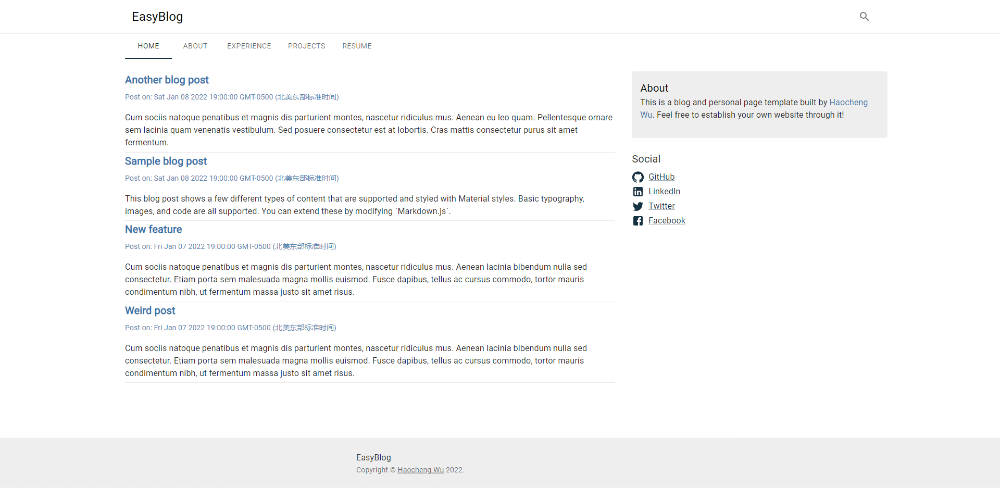
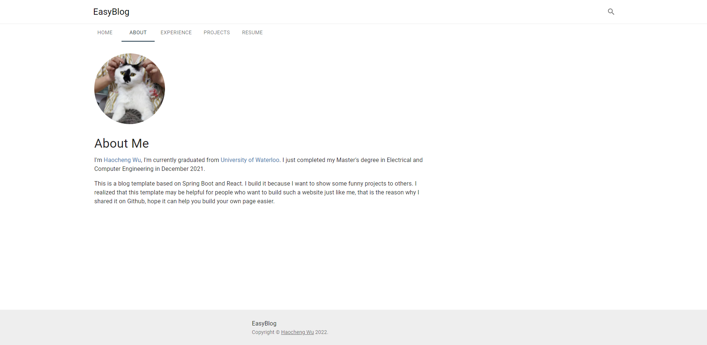
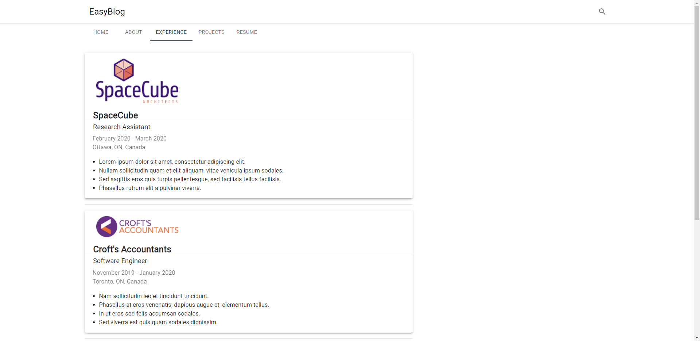
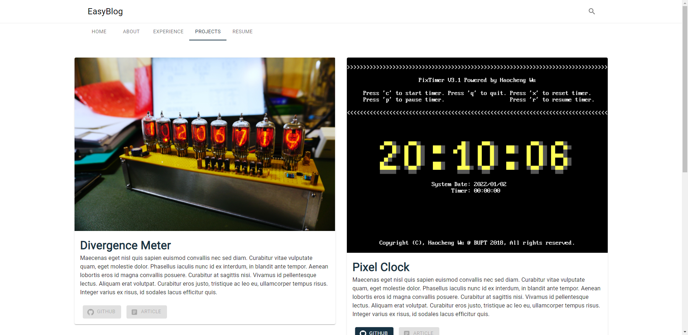

# EasyBlog
A blog template based on ***Spring Boot***, ***MySQL***, ***React***, and ***Material-UI***.

# Introduction
This is a tech blog template based on ***Spring Boot***, ***MySQL***, ***React***, and ***Material-UI***. The purpose of this project is to 
provide a easy to use blog template for someone to establish their first personal page.

I just start this project a couple days ago and I'm new to React, thus I need some time to be familiar with the framework such that 
I can add more functions on this template. You can see a TODO list in the following section which indicates my recent plans for it.

If you want to check how it would look like if using this template to establish a real blog, you can visit my own page: [TODO]. It's fully based 
on this template. Besides, you can also find some snapshot of the template in the following section.

# Functionalities
- [ ] Blog Articles
    - [x] Backend APIs (Articles information CRUD)
    - [x] Article List
      - [ ] Pagination
    - [ ] Article Tags
    - [ ] Article Search
    - [ ] Markdown-based editor
    - [ ] Comment
    - [ ] Article Manager (Need to manually add articles into database currently)
- [x] About Me Page
- [x] Experience Page
- [x] Project Page
  - [x] Project Tags
  - [x] Project Links (Github & Article)
- [x] Resume Page 

# Environment
- Backend
  - Java 8
  - MySQL 8
- Frontend
  - Node.js 17
  - React 17
  - Material-UI 5

# Instructions

## Backend
Before run the backend server, build the project through maven wrapper:

    easyblog-backend > ./mvnw clean pakacge

Then, start the server through command below:

    easyblog-backend > ./mvnw spring-boot:run

Make sure there is a database called 'blogdb' in your local MySQL server and 
remember to replace your own MySQL URL, username, and password in 'easyblog-backend/src/main/resources/application.properties'
, otherwise the server won't start.

## Frontend
To start the frontend server, build the project through Node.js:

    easyblog-frontend > npm install

When the build is completed, run command below to start the server:

    eastblog-frontend > npm start

# Snapshots
## Home Page

## About Page

## Experience Page

## Project Page
